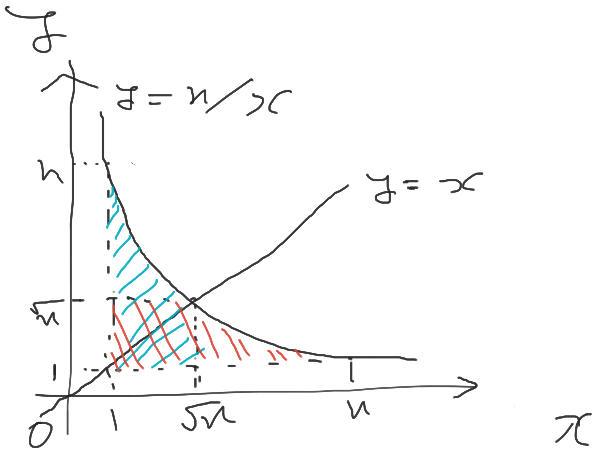

https://atcoder.jp/contests/abc230

# E - Fraction Floor Sum

$\sum^{n}_{i=1} \mathrm{floor}(N/i)$ を求める問題。
言い換えると $y \le n / x$, $(1 \le x \le n)$ の範囲にある格子点の数を数える。

$y = n/x$ は $y = x$ に関して対称であり、$y = n/x$, $y = x$ は $(x,y) = (\sqrt{n}, \sqrt{n})$ で交わる。

対称性より図の青い斜線の領域に含まれる格子点の数 ($\sum^{\mathrm{floor(\sqrt{n})}}_{i = 1}\mathrm{floor}(N/i)$) と、赤い斜線の領域に含まれる格子点の数は一致する。2つの領域で共通する部分に含まれる格子点の数は $(\mathrm{floor}(\sqrt{n}))^2$。

したがって、

$\displaystyle \sum^{n}_{i=1} \mathrm{floor}(N/i) = 2\sum^{\mathrm{floor(\sqrt{n})}}_{i = 1}\mathrm{floor}(N/i) - (\mathrm{floor(\sqrt{n})})^2$.

計算量は $O(\sqrt{n})$ で解ける.

